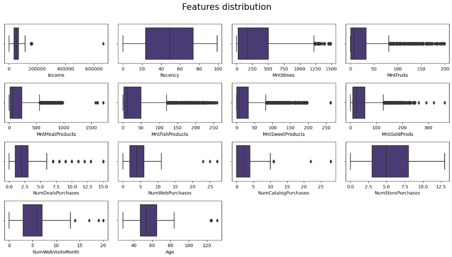
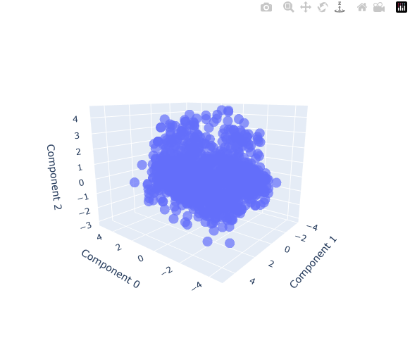
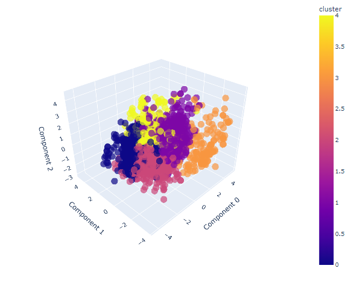

## E-Commerce Customer Segmentation

### Project Overview

## Customer Segmentation (with PCA) 

### Project Overview
* In this project we will start using PCA for dimensionality reduction and then perform customer segmentation with K-means clustering algorithms.  
* Our goal is to reduce the original 29-features dataframe to an only 3 components dataframe via pca, find the clusters within them, and visualize in a 3D plot.

### Code and Resources Used 
**Python Version:** 3.7  
**Packages:** pandas, numpy, matplotlib, seaborn, plotly, sklearn.

### Dataset
The dataset is from: https://thecleverprogrammer.com/2021/02/08/customer-personality-analysis-with-python/#google_vignette

### nbviewer version
* link to notebook with Plotly visualizations enabled:  
https://nbviewer.org/github/facundoriosds/Project-12-Store-Customer-Segmentation/blob/main/P_12.ipynb

Notebook captures:

